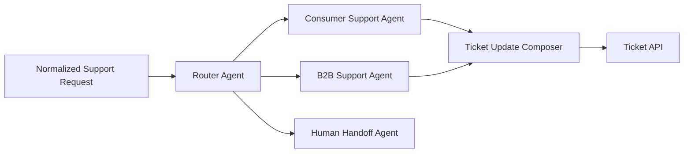

Hamburg 2026 was my first AWS Summit in person; I'd only followed it through recordings before. The shift in the AI sessions was immediate. Last year the talks were mostly roadmaps: architecture diagrams for systems still being built, phrases like "we're exploring" and "we're excited about the potential." This year, several major companies, from automotive manufacturing to energy, e-commerce, and food delivery, each opened with results.

The infrastructure for agentic AI is real now. The questions still open are about safety, not capability.

## Strands Agents: letting the model decide

I started the day with the Strands Agents talk. We're already using Strands at work, so I expected mostly familiar ground. What was actually new was how far they've pushed the model taking over orchestration decisions that developers used to make manually.

The shift sounds small but changes everything: you don't define which agent to call when. The orchestrator figures it out. The model reads the task, decides what capability it needs, and routes itself. That means less brittle wiring in your agent graph and more flexibility when edge cases appear at runtime.

Three capabilities stood out:

> **Self-extending:** Agents write their own Python tools on the fly. Because the framework can reload tools at runtime, an agent can recognize a missing capability, write the code for it, save it, and execute that new tool immediately, without a restart.
>
> **Self-directing:** Agents update their own system prompts based on interactions and store those updates in persistent memory. When deployed with Amazon Bedrock AgentCore, they use Amazon Bedrock Knowledge Bases to retrieve past sessions, so context accumulates across conversations.
>
> **Meta-agents:** A primary orchestrator spawns sub-agents based on the task. Three patterns: Swarm (sub-agents work on parts of the problem in parallel, sharing a context space), Graph (directed hand-offs between specialized agents in sequence), and Think (the agent recursively spawns instances of itself to deepen reasoning before answering).

Similar talk from AWS re:Invent 2025: [Strands Agents deep-dive](https://www.youtube.com/watch?v=RQfW7eQsXqk&t=3130s).

## When an enterprise HR platform runs itself

A global energy company's HR team had a legacy data distribution system. Expensive, rigid, built for a world where data formats and sources didn't change often. They replaced it with a serverless platform on AWS, powered by Amazon Bedrock Agents and Amazon Bedrock AgentCore.

What made it interesting wasn't the migration. It was what they built on top: the platform is self-documenting, self-modifying, and self-healing. When a new data source appears, the system builds the ingestion Lambda and Step Functions itself. When a transformation fails, it diagnoses the failure, writes a fix, and deploys it. Engineers can ask the platform questions in natural language and get answers about its own internals.

The result: $800K in annual license savings, and a data delivery platform that largely operates without engineers in the loop for routine changes.

That's Level 3 maturity, which I'll explain below. Most teams aren't there yet. But seeing it running in production at a company of this size makes it harder to argue it's years away.

## Supply chain planning with agents

A global automotive manufacturer has been running ML-based forecasting and planning on AWS for years. The agentic layer they've added isn't a replacement for that infrastructure; it's a reasoning layer on top of it, one that can work through problems humans currently have to resolve manually.

The concrete example that stuck with me: "where is my tire and when will it arrive?" Sounds simple. Answering it requires querying across production schedules, capacity constraints, distribution paths, and carrier networks simultaneously, then reconciling those answers into something actionable. Before agentic AI, that took hours. Now it takes five minutes.

The architecture uses specialized agents that investigate production blocks and capacity constraints in parallel, then synthesize their findings into business-friendly explanations. That last part matters: the team specifically called out the move from black-box optimization to transparent decision-making. Supply chain planners needed to understand why the system made a recommendation, not just what it recommended. Agents that can explain their reasoning are the only version that gets adopted.

## Privacy-first, then ship

One talk stood out for its honesty about what the path to production actually looks like. The team behind a European e-commerce platform didn't start with a multi-agent architecture. They started with a single Bedrock API call for intent classification and predefined response templates, built data privacy compliance in from day one, then iterated from there: prompt engineering, Bedrock Agents, multi-agent orchestration, and finally Amazon Bedrock AgentCore. Each phase had a ceiling where the simpler approach stopped being good enough.

The result of that iteration: over 50% of first-level support tickets are now handled by AI, and resolution time is down 60%.

Privacy was the first design constraint throughout, not an afterthought. Before any ticket content reaches an LLM, it goes through an anonymization layer that strips PII using pattern matching and rules. Only anonymized content goes forward. The gate pipeline:

One detail I hadn't considered before: they tried sending the AI response five seconds after ticket submission. Customer satisfaction dropped. People felt the speed was inhuman and didn't trust the answer. They now add an artificial delay. The content didn't change, the timing did, and satisfaction went back up.

The system splits B2C and B2B into separate agent chains, because B2B tickets carry more company-specific context and require more specialized handling. Observability is built in from the start: every response is traced, retrieval success rates and model usage are tracked, and quality scores feed back into the system. That observability also changed how the team debugs. The question shifted from "what did the model answer?" to "why did the workflow behave this way?", which means tracing which tools were called, what was retrieved and how relevant it was, where latency came from, and what CSAT scores and ticket reopen rates are telling you about specific workflow paths.

> Multi-agent does not mean everyone talks to everyone.

Bounded specialization reduces accidental cross-talk and makes handoff behavior easier to reason about. A few architectural decisions that make this work in practice:

- The **Router Agent** decides which specialized agent handles the request; nothing else does routing.
- Specialized agents are isolated by responsibility and don't call each other directly.
- Only the **Ticket Update Composer** writes back to external systems (Ticket Systems).
- Human escalation is an explicit path, not a fallback you discover at 2am.
- Tool permissions and handoff contracts are defined up front, not negotiated at runtime.

The architecture is only part of what makes this production-grade. Agents introduced operational concerns that became part of the product itself:

- **IaC and reproducibility**: agents, collaborators, roles, Lambda functions, API Gateway, and knowledge base configuration all need reproducible deployment. Drift between environments is a real failure mode.
- **Aliases and versioning**: promote tested versions explicitly; don't rely on draft agent behavior in production.
- **Latency budgets**: multi-tool workflows can exceed webhook timeouts. Latency is a design constraint, not a monitoring afterthought.
- **Structured traces**: log intent, retrieval, tool inputs, API errors, and response payloads. Debugging an agentic workflow without traces is guesswork.
- **Human QA sampling**: review low CSAT scores, ticket reopen rates, and escalation reasons on a regular cadence.
- **Cost guardrails**: cap agent steps, retries, token budgets, and retrieval depth. Unbounded agents are a billing incident waiting to happen.

The customer sees the answer. Engineering owns the routing, policy, traces, and feedback loop.

Choosing the right level of agent complexity is its own decision. Not everything needs a full multi-agent setup:

| Use case | Direct Bedrock call | Bedrock Agent | AgentCore |
|---|---|---|---|
| One decision, known outputs | Best fit | Overkill | Overkill |
| Needs RAG + tools | Possible but manual | Best fit | Good fit |
| Multiple topics / generated answer | Limited | Best fit | Good fit |
| Cross-channel middleware | Possible | Best fit | Good fit |
| Longer-term memory / operations | Limited | Partial | Best fit |

Don't optimize for "most agentic." Optimize for the minimum autonomy that solves the customer problem with acceptable operational risk.

Their lesson for anyone starting this: get your data security and privacy team involved before you write the first line of agent code. The design decisions they'll ask for are the ones you can't retrofit later.

## AgentCore: building multi-tenant AI as a service

I also caught the expert-level session on building multi-tenant SaaS agents with Amazon Bedrock AgentCore. If you're building a platform where multiple customers each get their own AI agents, the isolation problem is harder than it looks.

Tenant isolation in agentic systems runs across five dimensions: identity (each tenant's agents act with scoped credentials), memory (one tenant's conversation history can't leak into another's context), gateway (routing and rate-limiting per tenant), observability (tenant-scoped traces so you can debug without seeing another customer's data), and runtime (compute isolation so a runaway agent in one tenant doesn't affect others). The session walked through working examples for each.

The framing they used, "intelligence as a service," is worth keeping. If you're building AI capabilities that other teams or customers consume, the SaaS constructs of onboarding, isolation, and identity propagation apply just as much as they do to any other service you'd build. The AgentCore primitives give you the building blocks; you still have to wire them together intentionally.

Similar session recording: [Building Multi-Tenant SaaS Agents with Amazon Bedrock AgentCore](https://www.youtube.com/watch?v=uwXrtyXXuy8).

One published example that shows AgentCore working on a real regulated domain: an open-source medical content review application that cross-checks pharmaceutical marketing claims against clinical references, PubMed, OpenFDA, and ClinicalTrials.gov. A few architectural decisions in it are worth studying regardless of your domain. First, the reviewer sub-agents persist their findings to S3 and return only an S3 URI to the orchestrator; hundreds of findings from a 30-page document never flow through the orchestrator's context window, which would cause it to summarize and drop findings. Second, user identity is extracted server-side from the JWT `sub` claim, never from the request payload, which closes the impersonation-via-prompt-injection vector directly. Both patterns are reusable. Full writeup and open-source repo: [Accelerate Medical Content Review with Amazon Bedrock AgentCore](https://builder.aws.com/content/37phdmvQL1KmluO9s6xx0TJMod2/accelerate-medical-content-review-with-amazon-bedrock-agentcore).

## The maturity ladder

Across several talks, a rough framework emerged for how companies are thinking about agentic AI maturity.

**Level 1** is rules-based AI. The system follows defined policies, humans define every decision path, and the AI fills in specific gaps.

**Level 2** is autonomous task AI. The system handles entire workflows: self-documentation, quality monitoring, task routing. Humans oversee outcomes, not individual steps.

**Level 3** is self-monitoring systems. The system diagnoses its own failures and builds capabilities it didn't have before. Human oversight is exception-based, not routine.

Most of the companies presenting were somewhere in the Level 1 to Level 2 transition. The energy company's HR platform was the one example of Level 3 running in production. That gap is worth knowing about before you start planning, because Level 2 requires different architecture decisions than Level 1, and Level 3 requires different trust decisions than Level 2.

## What's still open

The results are real: $800K saved, hours to five minutes, resolution time down 60%. These aren't demos.

But three problems came up in nearly every talk, and nobody presented a clean solution.

**Hallucination in production** has operational consequences now. When your agent is writing transformation plugins and deploying them, a confidently wrong answer triggers real failures. Teams are managing this with human-in-the-loop gates at specific checkpoints.

**Prompt injection and prompt protection** got less stage time than they deserved. As agents act on data from external systems, the attack surface grows. One concrete mitigation that came up in the AgentCore examples: extract user identity from the JWT server-side, never from the request payload, so attackers can't impersonate users through crafted input. That closes one specific vector; the broader problem of agents acting on adversarial content from external sources is still largely unsolved in practice.

**Data privacy at scale** is hard even with PII anonymization. Cross-border data flows, multi-system agents, and context accumulating in memory all create compliance complexity that rules-based anonymization doesn't fully address.

These are reasons to build carefully, with privacy by default and observability from day one. They're not reasons to wait.

## Context engineering is the next skill

Prompt engineering was the first visible handle: write better prompts, get better outputs. The feedback loop was tight. The harder problem in agentic systems is what surrounds the prompt: what context an agent has access to, when it gets loaded, how much fits in the window, and what happens when it doesn't.

The AgentCore medical content review example makes this concrete. Reviewer sub-agents persist findings to S3 and hand the orchestrator a URI instead of the content; the full set is loaded once, at the final editing pass. That's a context engineering decision: controlling which information exists in which agent's window at which moment, specifically to prevent the model from silently dropping findings it can't fit.

The same pattern shows up in the Strands memory model (Bedrock Knowledge Bases retrieve relevant past sessions, not all of them) and in the e-commerce platform's lifecycle gates (explicit stages controlling what context is available at each step). Every multi-agent architecture at the summit made the same choice. The common thread is explicit decisions about what each agent knows and when.

Context windows are a real production constraint, not a theoretical one. As agents chain together and produce intermediate output, what you carry forward and what you discard is an architectural choice. Getting it wrong makes the system quietly incorrect in ways that are hard to debug, because the model won't tell you it dropped something.

Treat context design with the same seriousness as a data model.

## What I took away

The energy was different from the recordings I'd watched in previous years. Companies were comparing notes, sharing what broke and what they'd do differently.

The part worth repeating to anyone building with AI right now: share the positive stories. The results from these companies are real and worth talking about with your team. And while you're doing that, keep hallucination and data protection as first-class design constraints, not late-stage reviews. Include the people who care about those things early; they make the system better, not slower.

---

*These are my personal impressions from the conference. The views here are my own and don't represent my employer or any of the companies mentioned. If I got something wrong or misunderstood a detail, ping me on [LinkedIn](https://www.linkedin.com/in/larsroettig/) and I'll correct it.*
