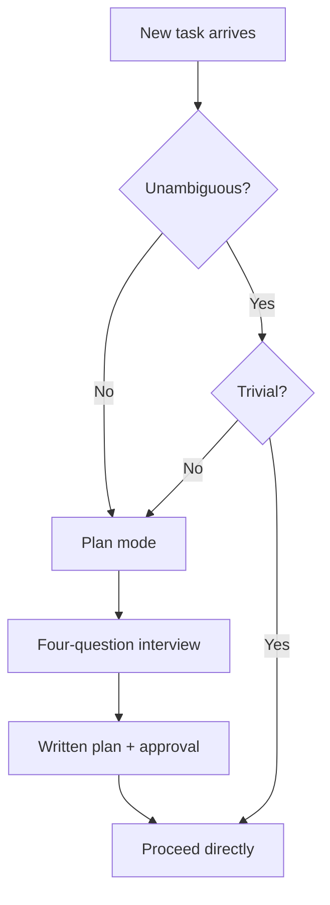
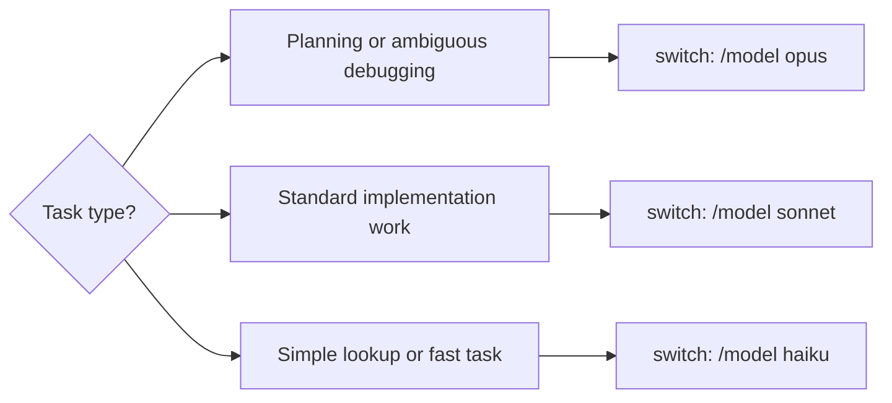
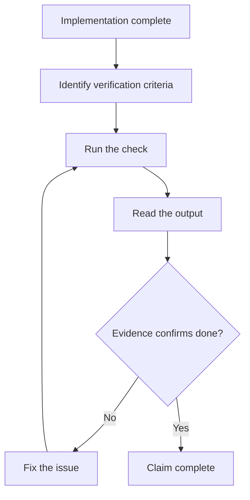

ThoughtForge started as a tool for my own meeting transcripts. Three or four per day, each generating action items that scattered across Notion, Slack, and browser tabs I kept open as a reminder. I wanted one local tool that pulled them together without sending meeting content to an external API.

I built it with Claude Code as the primary development tool throughout. Making AI reliable enough to use on a real product turned out to be the harder problem, and more interesting than the Rust learning I'd expected.

## Rules are the interface

Early on I wrote prompts. "Implement this feature," "fix this bug." The output was inconsistent and occasionally introduced regressions in code it wasn't supposed to touch.

Writing explicit rules changed output quality more than any prompt refinement. The rules went into `.claude/rules/SECURITY.md`: no `unwrap()` or `expect()` on external input because panics are denial of service, no `==` on secret bytes (use constant-time comparison), all markdown through `DOMPurify.sanitize()` before rendering. When those rules existed in writing, the model followed them consistently across sessions. Without them, I got different decisions on similar code every time.

Rules aren't documentation for humans. They're the interface you use to get consistent output. The model can't hold your standards across sessions without them, and "remember to always..." in a prompt dissolves the moment the context window clears.

## Plan mode and the interview pattern

Half the bad AI code I'd written before ThoughtForge was solving the wrong problem. I'd ask for feature X, the model would implement X well, and I'd realize I wanted something slightly different that X now made harder to reach.

The fix was a `.claude/rules/PLANNING.md` protocol: before any non-trivial task, enter plan mode and answer four questions before writing a line of code. What is the goal and what does done look like? What must not change or break? Is there existing code to reuse? What edge cases matter?

The decision whether to plan is a two-question gate. Is the task unambiguous? Is it trivial? Both must be true to proceed directly. One false answer means plan mode.

This sounds like overhead. It isn't. The interview usually takes three exchanges. Those three exchanges caught more scope errors than code review because scope errors surface as wrong architecture weeks later, which code review never catches in time.

One rule I added after the first month: if scope grows during implementation, stop, update the plan, get re-approval. The model adapts mid-task fine. I need to be in the loop when the scope changes.

## Pick the right model for the job

Claude Code gives you three models. Using all three deliberately is worth the discipline.

Opus handles planning sessions, ambiguous debugging, and anything where the cost of the wrong decision is high. It's slower and more expensive, but on a genuinely hard architectural question or a bug with no obvious hypothesis, the reasoning quality difference is real. Sonnet covers the bulk of a session: implementation and standard feature work with a clear spec. Haiku fits context-light tasks where speed matters and the question is simple enough that a lighter model won't drift.

I defaulted to Sonnet for most of ThoughtForge and switched to Opus when a Tauri IPC bug had me stuck for more than 20 minutes without a clear hypothesis, and for every planning session. The per-token cost difference across a full project is maybe a few dollars. The reasoning quality on genuinely hard problems is worth that.

One setting that helped: `showClearContextOnPlanAccept: true` in `.claude/settings.json`. After plan approval, the context clears so implementation starts fresh without planning conversation bleeding into it.

## TDD with AI

"Write tests for this component" produces coverage. "Write a failing test for this behavior, then make it pass" produces better code.

The difference is the success criterion. A failing test gives the model something concrete to satisfy. Without one, it tends to write tests that confirm whatever the code already does, which is documentation with assertions, not testing.

Writing E2E tests late was my biggest ThoughtForge mistake. By the time I added Playwright I had 40+ components written without testability in mind. Coverage in the spaces view is still thin because retrofitting tests against components not designed for it is painful enough that I kept deprioritizing it. Starting with Playwright tests for two or three critical user paths would have forced cleaner component boundaries from the beginning.

## What AI kept doing wrong

Three patterns showed up repeatedly, and all three had the same root cause.

The first was solving adjacent problems: I'd ask for a bug fix and get the fix plus a refactor of something nearby the model judged as messy, usually with a regression in the refactor. The second was flexibility abstractions: I'd ask for a simple implementation and get a configurable, extensible version with options I hadn't asked for and wouldn't use, each one immediate maintenance cost. The third was formatting drift: editing one function would reformat the whole file, producing a noisy diff with no functional change.

All three happen because the model delivers the code quality it infers you want, which is typically more than you asked for. The fix is the same for all three: "touch only what you must, every changed line must trace directly to the request." Written as a rule, the model follows it.

## Verify before you claim done

The model is optimistic. It will describe a task as complete before the build has run.

The fix is a verification gate before any completion claim. Identify what done looks like, run the checks, read the actual output.

The question I ask before accepting any completion claim: would a staff engineer approve this based on the evidence in front of me right now? If the answer is no, the task isn't done.

Read the diff and run the suite. The model's description of what it did and what the diff shows are often different things.

## Human in the loop: specialist personas

The highest-ROI thing I added late: give the model a specific expert identity before asking it to review anything.

"You are an Apple platform security engineer. Audit this code for vulnerabilities. List findings with severity and file:line. Do not fix anything."

"You are a senior TypeScript/React engineer doing a code review. Flag maintainability issues and duplication. Do not fix anything."

"You are a frontend performance engineer. Identify rendering bottlenecks and data-fetching inefficiencies. Do not fix anything."

Same model, different frame, different output. The security pass found `Date.now()` being used for task IDs (predictable; replaced with `crypto.randomUUID()`) and 3 places where `DOMPurify` wasn't applied. The code review pass flagged ~40 lines of duplicated streaming logic across two handlers. The performance pass surfaced a stale closure in the tab-switch save path that was silently discarding data on rapid tab switches.

"Do not fix anything" is the load-bearing constraint. The model audits; I decide what to act on. I can reject findings that don't apply without the model having already changed the code, which keeps me accountable for the outcome.

## Hooks: automation without asking

Claude Code settings support hooks — shell commands that run automatically in response to specific events. Three I use:

`Notification`: plays a system sound when Claude Code needs input. Three minutes into a long implementation run, I've usually switched context. The notification gets me back before the model idles.

`PreToolUse` with path filtering: blocks edits to generated files (GraphQL schema, build outputs). Without this, the model occasionally edits files it should have regenerated, producing corrupted output that's hard to trace back.

`PostToolUse`: logs tool calls to a file during debugging sessions. After a session where the model had edited the wrong version of a file, replaying the tool call log saved about an hour of reverse-engineering what had happened.

Hooks live in `.claude/settings.json`. They're shell commands, so any script in your environment works: notification scripts, linters, CI triggers.

## Built-in commands worth knowing

Six that changed how I work:

`/goal <condition>` — set an explicit session exit criterion the model checks itself against before claiming done. Example: `/goal all Playwright tests pass and tsc reports 0 errors`. Useful for long implementation sessions where you want the model to hold itself accountable to a specific bar.

`/compact` — summarize the conversation and compress context. When a session has been running long and earlier planning context is no longer relevant to current work, compacting keeps the active window focused on what matters now.

`/resume` — restore from the last session. Useful when a session ended unexpectedly or when picking up work the next morning.

`#` — add a correction or context the model incorporates immediately. When I catch a wrong assumption mid-session, `# the edge case here is X, not Y` is faster than explaining it in a full message, and it goes into the conversation context cleanly.

`!<command>` — run a shell command inline and get the output in the session. `!npm run test` mid-implementation gives you the result without leaving the conversation.

`/model opus` — switch models mid-session with full conversation context preserved. Reach for it when a problem turns out to be harder than the initial prompt suggested.

## What I'd tell myself at the start

Write rules before writing prompts. Rules load every session; a prompt disappears with the context window.

Run the two-question gate before every task: is this unambiguous, and is it trivial? Both true means proceed. One false means interview before code.

Pick the model for the job. Sonnet by default, Opus when the problem is genuinely hard or the cost of the wrong answer is high.

Write the failing test first. A concrete failing test is a better spec than a description, and the model writes better code against a spec.

Verify with evidence before claiming done. Read the diff and run the build. The model's description and the actual result are different things.

Run the three specialist-persona audits before shipping: security, code review, performance. Each is a separate conversation with a fixed identity and "do not fix anything" as a hard constraint. The human reads findings and decides what to act on.

---

Code is on GitHub: [larsroettig/thoughtforge](https://github.com/larsroettig/thoughtforge). MIT license.
